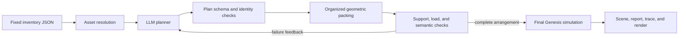

# Agentic Packing

[](https://github.com/Zarad0X/agentic-packing/actions/workflows/ci.yml)
[](https://www.python.org/)
[](LICENSE)

**Agentic Packing** arranges a fixed collection of real-world objects into a
container using an LLM planner, deterministic geometry and support reasoning,
and an optional Genesis rigid-body validation pass. Give it a crate, sink,
basket, tote, or tabletop plus roughly 20 object instances; it returns a complete,
auditable arrangement rather than merely generating a plausible image.

The system is designed for dense, everyday storage. It tries to use the bottom
surface before opening upper layers, groups related objects, nests only models
that are explicitly marked stackable, checks load-bearing and semantic support,
and sends concrete failure feedback back to the agent when a proposed plan cannot
be realized.

This repository began as an independent clean-room reproduction of the scene
arrangement core in **PhyScensis: Physics-Augmented LLM Agents for Complex
Physical Scene Arrangement** (Wang et al., ICLR 2026). It has since evolved into
a practical fixed-inventory packing pipeline. It is not the authors' official
implementation and does not contain their private BlenderKit assets or robot
experiments.

## What works today

- **Fixed inventory:** every supplied object ID is immutable; the planner may not
  omit, replace, duplicate, or invent objects.
- **Agentic planning:** the default agent is the authenticated local Codex CLI.
  An OpenAI Responses API adapter and a deterministic offline baseline implement
  the same interface.
- **Dense placement:** global floor-first search, hole backfilling, 90-degree
  orientations, multiple support layers, and optional controlled protrusion.
- **Household organization:** adjacency hints, repeated-object grouping, explicit
  plate/bowl/cup nesting, support-load limits, and semantic compatibility rules.
- **Closed-loop correction:** invalid schemas, unsafe stack requests, and
  unplaced object IDs become structured feedback for the next planning round.
- **Licensed real meshes:** a frozen 24-model Objaverse CC BY 4.0 asset pack with
  hashes, attribution, opacity checks, embedded-texture checks, and dense-scene QA;
  plus a credential-free manifest for 19 user-authorized BlenderKit candidates
  that have passed thumbnail, GLB, opacity, and neutral Blender-render review.
- **Physical validation:** one final 400-step Genesis simulation of the assembled
  scene, plus a fast deterministic backend for development and regression tests.
- **Auditable outputs:** the resolved inventory, agent rounds, support graph,
  arrangement metrics, simulator report, scene state, and render are serialized.

The latest end-to-end tool-crate demonstration packed all 20 supplied licensed
models after one feedback-driven replanning round. On an RTX A6000 it achieved
83.5% floor coverage, an 85.0% organization score, zero load or semantic support
violations, zero visible support gaps, and 0.322 mm final settle displacement.
These are results for that frozen example, not a general benchmark claim.

## Pipeline



The LLM makes high-level decisions: placement order, which repeated objects may
form a stack, and which peers should stay adjacent. It does **not** directly set
unverified final poses. Geometry, containment, collision proxies, stackability,
support area, load limits, and simulator measurements remain code-controlled.
This separation makes the result reproducible and prevents a persuasive agent
response from bypassing physical constraints.

The expensive simulator is intentionally called only after deterministic search
has assembled a complete candidate scene. Rebuilding Genesis for every candidate
would repeatedly compile kernels and make the feedback loop impractical.

## Installation

### 1. Core development environment

The core solver and quasistatic backend run on macOS or Linux without a GPU.

```bash
git clone https://github.com/Zarad0X/agentic-packing.git
cd agentic-packing
python3 -m venv .venv
. .venv/bin/activate
python -m pip install --upgrade pip
python -m pip install -e '.[dev,render]'
agentic-packing doctor --backend quasistatic
```

The legacy `physcensis` executable remains available as a compatibility alias.
New documentation and scripts should use `agentic-packing`.

### 2. Codex planning agent

The default fixed-inventory agent uses the local Codex CLI and its existing
authentication. No `OPENAI_API_KEY` is needed.

```bash
codex --version
agentic-packing arrange --help
```

Unless `--model` is passed, the inner agent uses the default model in the current
Codex configuration. The trace records the provider and resolved model metadata.
If the outer process is sandboxed, it must still allow Codex to update its normal
session state under `~/.codex`.

### 3. Genesis GPU backend

Genesis validation requires a CUDA-capable Linux machine. The validated setup
uses an RTX A6000; CPU-only machines should use `--backend quasistatic`.

```bash
python -m pip install -e '.[dev,render,genesis]'
CUDA_VISIBLE_DEVICES=0 agentic-packing doctor --backend genesis
```

### 4. Optional OpenAI API agent

This adapter is retained for paper-model comparisons and explicit API runs.

```bash
python -m pip install -e '.[agent]'
export OPENAI_API_KEY=...  # never commit credentials
```

## Five-minute local demo

Run the 20-object dish inventory with the real Codex planner and fast deterministic
validation:

```bash
agentic-packing arrange \
  --inventory examples/inventory_dish_sink.json \
  --output output/scenes/inventory_dish_sink_codex \
  --agent codex \
  --backend quasistatic \
  --stability-samples 0
```

The dish example contains four plates, four bowls, four explicitly stackable
cups, two ordinary handled cups, jars, cans, and pantry boxes. Plates, bowls,
and handleless stackable cups may be nested. Ordinary cups remain separate
because their asset metadata does not authorize nesting.

For a deterministic smoke test that does not call an LLM:

```bash
agentic-packing arrange \
  --inventory examples/inventory_dish_sink.json \
  --output output/scenes/inventory_dish_sink_offline \
  --agent deterministic \
  --backend quasistatic \
  --stability-samples 0
```

The deterministic agent exercises the same plan parser and physical solver, but
its output must not be reported as an LLM result.

## End-to-end run with licensed meshes and Genesis

Large model files are not committed. Fetch and verify the frozen Objaverse pack
on a networked machine:

```bash
agentic-packing assets \
  --action fetch \
  --manifest assets/manifests/objaverse_cc_by_v3.json \
  --cache assets/cache/objaverse_cc_by_v3/original

agentic-packing assets \
  --action validate \
  --manifest assets/manifests/objaverse_cc_by_v3.json \
  --cache assets/cache/objaverse_cc_by_v3/original
```

Then run the real 20-object tool-crate example:

```bash
CUDA_VISIBLE_DEVICES=0 agentic-packing arrange \
  --inventory examples/inventory_tool_crate.json \
  --output output/scenes/inventory_tool_crate_codex_genesis \
  --agent codex \
  --backend genesis \
  --stability-samples 0 \
  --asset-manifest assets/manifests/objaverse_cc_by_v3.json \
  --asset-cache assets/cache/objaverse_cc_by_v3/original
```

`--stability-samples 0` disables the optional perturbation estimate but still
runs the final assembled-scene 400-step Genesis simulation. Use `64` for the
paper-sized 11D perturbation estimate.

## Supplying your own 20 objects

An inventory has exactly one container and a list of object instances:

```json
{
  "container": {
    "object_id": "my_crate",
    "category": "tool crate",
    "position_xy_m": [0.0, 0.0],
    "yaw_deg": 0.0
  },
  "objects": [
    {"object_id": "drill_01", "category": "drill"},
    {
      "object_id": "wrench_01",
      "category": "wrench",
      "asset_uid": "3be07a34145f4bd0bbc2dd01f8fca136"
    }
  ],
  "arrangement": {
    "allow_protrusion_m": 0.10
  }
}
```

Every `object_id` must be unique. There are three ways to resolve its geometry:

1. **Category lookup** — `category` deterministically selects a catalog model.
2. **Frozen asset UID** — `asset_uid` pins an exact allowlisted mesh and requires
   `--asset-manifest` plus `--asset-cache`.
3. **Inline user asset** — an `asset` object may provide `size_m`, `mesh_path`,
   mass, friction, support probability, transforms, and provenance. Relative mesh
   paths resolve from the inventory file, and the mesh hash is frozen in the
   exported scene.

Mesh coordinates are expected to match the declared visual scale. `size_m` or
`collision_size_m` remains the physical proxy authority. External visual meshes
do not silently change packing feasibility.

The agent must return:

- a placement-order permutation containing every input object exactly once;
- optional `stack_groups`, ordered bottom-to-top and restricted to assets marked
  stackable;
- optional `adjacency_groups` for semantically related peers.

Invalid identity changes, incomplete permutations, duplicate group membership,
unsafe nesting, and incorrect stack order are rejected before placement begins.

## Outputs and audit trail

Each successful `arrange` run writes:

| File | Contents |
| --- | --- |
| `scene.json` | Resolved assets, final poses, support graph, placement order, provenance, and metadata |
| `report.json` | Success category, issues, settle distance, coverage, packing, organization, and contact metrics |
| `llm_trace.json` | Exact inventory facts, every agent response, model/provider metadata, validation status, and solver feedback |
| `overview.svg` | Deterministic top-down diagnostic render |
| `overview.png` | Genesis render when the GPU backend and renderer are used |

Important metrics include:

- `floor_coverage`: occupied fraction of usable container floor;
- `bottom_layer_item_fraction`: how many items found a genuine floor placement;
- `packing_layer_count`: number of realized support heights;
- `organization_score`: combined coverage, compactness, grouping, and support quality;
- `load_bearing_violation_count` and `semantic_support_violation_count`;
- `maximum_visual_contact_gap_m`: remaining presentation gap after support-graph alignment;
- `settle_distance_m`: final displacement measured by the selected backend.

Do not treat an SVG from the quasistatic backend as physics evidence. It is a
geometry diagnostic. Physical claims require a Genesis report from the final
assembled scene.

## Agent choices

### Codex, default

```bash
agentic-packing arrange ... --agent codex
agentic-packing arrange ... --agent codex --model gpt-5.6-sol
```

The Codex adapter runs non-interactively with a strict final-response JSON Schema
and a read-only inner sandbox. The solver's feedback is included in the next
round when a plan is invalid or incomplete.

### OpenAI Responses API

```bash
agentic-packing arrange \
  --inventory examples/inventory_dish_sink.json \
  --output output/scenes/inventory_dish_sink_o4mini \
  --agent openai --model o4-mini \
  --backend quasistatic
```

### Deterministic baseline

Use `--agent deterministic` for tests, offline debugging, and comparisons where
LLM variability is undesirable.

## Other entry points

| Command | Purpose |
| --- | --- |
| `arrange` | Arrange a fixed inventory; this is the primary Agentic Packing workflow |
| `generate` | Execute an existing predicate program from JSON |
| `prompt` | Generate both objects and predicates from a free-scene description |
| `demo` | Serve the local browser interface at `http://127.0.0.1:8787` |
| `benchmark` | Run frozen `core`, `dense`, or `organized` acceptance suites |
| `assets` | Fetch or hash-validate a licensed asset manifest |
| `doctor` | Check configuration and backend imports |

Start the browser demo:

```bash
python -m pip install -e '.[demo,render]'
agentic-packing demo --backend quasistatic
```

The separate free-scene path is useful for reproducing the original paper-style
task where the agent creates both the object set and the predicates:

```bash
agentic-packing prompt \
  --prompt "Create a warm dining table for four people" \
  --output output/scenes/dining_table \
  --backend quasistatic
```

## Benchmarks and acceptance gates

Run the test suite and static checks:

```bash
python -m pytest -q
python -m ruff check src tests
```

Run the deterministic scene gates:

```bash
agentic-packing benchmark \
  --suite core --backend quasistatic --repetitions 20 \
  --report output/evaluation/core_quasistatic_100.json

agentic-packing benchmark \
  --suite dense --backend quasistatic --repetitions 10 \
  --report output/evaluation/dense_quasistatic_20.json

agentic-packing benchmark \
  --suite organized --backend quasistatic --repetitions 3 \
  --report output/evaluation/organized_quasistatic_6.json
```

The frozen core report contains 100/100 successful geometry generations over
five scene families. The dense report contains 20/20 successful runs; its basket
and sink scenes use multiple support layers. The organized gate additionally
requires floor coverage and compactness, zero overloaded or semantically invalid
supports, zero visible-gap violations, and a minimum organization score. These
reports are explicitly `geometry_only`; they do not replace GPU validation.

## Design details

### Floor-first organization

The organized solver sorts by footprint and load-bearing value but repeatedly
rescans remaining objects. Smaller pieces can refill floor holes before the
solver opens an upper layer. Upper placements must pass support-area, mass, and
semantic compatibility checks. Flat electronics are not treated as generic
shelves, while compatible paper goods or workshop tools may share supports.

### Explicit semantic stacks

Same-category objects are not automatically stacked. Nesting is accepted only
when the resolved asset is marked `stackable`, the agent requests an ordered
group, and domain validation approves it. The accepted columns are recorded in
`scene.metadata.semantic_stacks`.

### Collision versus presentation geometry

The system deliberately uses two representations:

- a compact procedural proxy controls collision, containment, support, and
  stability;
- a licensed GLB is a collision-disabled presentation overlay.

The support graph aligns visible upper objects to their visible supporters after
packing, removing apparent floating caused by proxy/mesh height differences.
This visual correction is measured and cannot alter the accepted collision scene.

### Asset quality gate

The `objaverse_cc_by_v3` manifest contains 24 manually screened models across 17
categories. Every entry must be CC BY 4.0, match its SHA-256, meet the frozen
quality threshold, remain opaque, carry embedded base-color textures, fit its
collision proxy, and pass dense Genesis scene QA. Scene scans, transparent assets,
extreme component counts, and models with poor proxy fill are rejected even when
their thumbnails look attractive.

`blenderkit_dense_v1.json` records a separate 19-model candidate pack spanning
dishware, containers, grocery objects, tools, and office items. The raw files stay
in a private authenticated cache and are never committed or redistributed. These
assets have passed Blender 5.2 import/render QA, but remain marked
`dense_scene_fit_status: pending` until proxy fitting and a real dense Genesis
scene are accepted; they do not silently replace the frozen Objaverse benchmark.

See [the asset guide](docs/asset_library.md) and
[the attribution ledger](assets/ATTRIBUTION.md) for exact provenance and license
terms.

## Repository layout

```text
agentic-packing/
├── assets/
│   ├── manifests/          # frozen licensed-model manifests
│   └── ATTRIBUTION.md      # source and license ledger
├── configs/paper.yaml      # solver, physics, feedback, and gate thresholds
├── docs/
│   ├── architecture.md     # module contracts and call flows
│   ├── asset_library.md    # asset acquisition and QA boundary
│   └── reproduction_spec.md
├── examples/               # predicate programs and fixed inventories
├── src/physcensis/         # Python package; retained for import compatibility
├── tests/                  # parser, solver, agent, asset, and gate tests
├── tools/                  # Objaverse and BlenderKit curation/audit utilities
└── output/                 # generated scenes and reports; mostly Git-ignored
```

The import package remains `physcensis` to avoid needlessly breaking existing
Python consumers. The distribution and primary CLI are named `agentic-packing`.
Module boundaries and sequence diagrams are documented in
[docs/architecture.md](docs/architecture.md).

## Reproduction boundary and limitations

In scope are the predicate language, fixed-inventory agent loop, spatial and
physical placement, stability estimation, structured feedback, licensed-asset
interfaces, rendering, evaluation, and dense demonstrations.

Not currently claimed:

- equivalence to the original authors' private approximately 800-asset library;
- reproduction of their robot demonstration pipeline;
- dense-scene/Genesis acceptance of the BlenderKit candidate pack (still pending);
- collision fidelity of arbitrary concave user meshes;
- universal optimality for packing or human household preferences;
- paper metric equivalence without identical assets, simulator versions, models,
  prompts, seeds, and evaluation data.

The current solver is strongest for container-scale rigid household, office, and
workshop objects represented by conservative box-like collision proxies. Flexible
objects, deformables, liquids, articulated containers, and manipulation-path
planning are outside the present contract.

The frozen method contract is in
[docs/reproduction_spec.md](docs/reproduction_spec.md). Please keep claims tied to
the backend and artifacts that produced them.

## Contributing

See [CONTRIBUTING.md](CONTRIBUTING.md). New assets must include redistributable
provenance, license metadata, a frozen hash, and visual/dense-scene QA evidence.
Changes to packing behavior should include a narrow unit test and, when relevant,
the corresponding acceptance-gate result.

## License

The code is released under [Apache License 2.0](LICENSE). External model licenses
are recorded separately in [assets/ATTRIBUTION.md](assets/ATTRIBUTION.md); the code
license does not supersede asset-specific attribution requirements.
