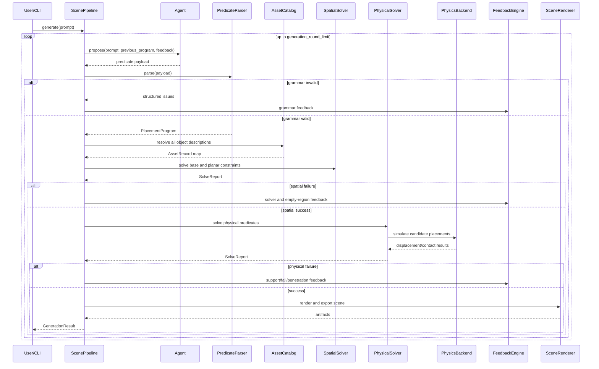
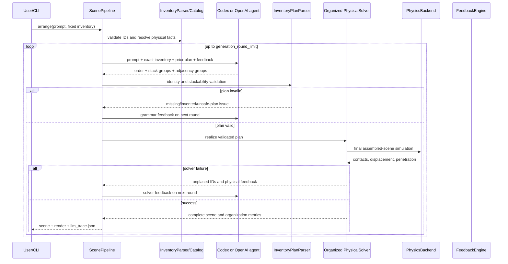

# Architecture

## Implementation approach

The repository separates symbolic intent, geometric solving, physical
validation, and presentation. Every backend consumes and returns serializable
scene state so deterministic geometry tests and expensive Genesis simulations
share one contract.

```mermaid
classDiagram
    class ReproductionConfig {
      +from_yaml(path: Path) ReproductionConfig
    }
    class PredicateParser {
      +parse(payload: list) PlacementProgram
    }
    class InventoryParser {
      +parse(payload: dict) InventorySpec
    }
    class InventoryPlanningAgent {
      <<Protocol>>
      +propose_inventory(prompt, inventory, previous_plan, feedback) dict
    }
    class CodexInventoryAgent {
      +propose_inventory(...) dict
    }
    class OpenAIInventoryAgent {
      +propose_inventory(...) dict
    }
    class InventoryPlanParser {
      +parse(payload, inventory, assets) InventoryArrangementPlan
    }
    class AssetCatalog {
      +resolve(description: str) AssetRecord
    }
    class ManifestAssetCatalog {
      +load(manifest, cache) ManifestAssetCatalog
      +resolve(description: str) AssetRecord
      +resolve_uid(object_id: str, uid: str) AssetRecord
    }
    class SpatialSolver {
      +solve(program: PlacementProgram, scene: SceneState) SolveReport
    }
    class PhysicalSolver {
      +solve(program: PlacementProgram, scene: SceneState) SolveReport
      +arrange_inventory(scene, objects) SolveReport
    }
    class PhysicsBackend {
      <<Protocol>>
      +simulate(scene: SceneState, steps: int) SimulationResult
    }
    class StabilityEstimator {
      +estimate(scene: SceneState, object_id: str) StabilityResult
    }
    class FeedbackEngine {
      +build(report: SolveReport) Feedback
    }
    class ScenePipeline {
      +generate(prompt: str) GenerationResult
      +run_program(program: PlacementProgram) GenerationResult
      +run_inventory(payload: dict) GenerationResult
      +generate_inventory(prompt, payload, agent) GenerationResult
    }
    class SceneRenderer {
      +render(scene: SceneState, output_dir: Path) RenderArtifacts
    }

    ScenePipeline --> PredicateParser
    ScenePipeline --> InventoryParser
    ScenePipeline --> InventoryPlanningAgent
    CodexInventoryAgent ..|> InventoryPlanningAgent
    OpenAIInventoryAgent ..|> InventoryPlanningAgent
    ScenePipeline --> InventoryPlanParser
    ScenePipeline --> AssetCatalog
    ManifestAssetCatalog --|> AssetCatalog
    ScenePipeline --> SpatialSolver
    ScenePipeline --> PhysicalSolver
    ScenePipeline --> FeedbackEngine
    ScenePipeline --> SceneRenderer
    PhysicalSolver --> PhysicsBackend
    PhysicalSolver --> StabilityEstimator
    StabilityEstimator --> PhysicsBackend
    SpatialSolver --> ReproductionConfig
    PhysicalSolver --> ReproductionConfig
```

The Genesis implementation deliberately validates the assembled scene once,
after deterministic occupancy and support checks select physical candidates.
Incrementally rebuilding a Genesis scene for every candidate triggers repeated
kernel compilation and is not suitable for an interactive demonstration. The
final 400-step simulation remains the authority for the reported physical
settle distance.

Licensed external geometry follows a dual-representation contract. A manifest
catalog resolves a frozen, hash-verified GLB plus its provenance and visual
transform, while the primitive catalog still resolves the object's collision
size, mass, friction, and semantic visual tag. Genesis creates the GLB as a
fixed, collision-disabled presentation entity and hides the proxy material; the
proxy body remains the only collision authority. This makes license/model swaps
auditable without changing packing feasibility or stability measurements.
Quality-gated manifests may additionally require an Objaverse++ score threshold,
an explicit non-transparent annotation, and `genesis_pass` for every entry; the
catalog refuses to load when any one of those conditions is missing.

For dense containers, `container_candidates` searches in container-local
coordinates so rotated containers and 90-degree package orientations share the
same bounds logic. Candidate heights come from the container floor and every
previously placed top surface. Each candidate must satisfy containment,
non-overlap, and a minimum support-area ratio before the physical solver can
accept it. This produces genuine multi-layer packing while keeping the
persistent scene representation compact and serializable.

The `organized` strategy adds a household-storage planner above that geometric
search. It first orders the complete mixed batch by footprint and load-bearing
value, but repeatedly scans all remaining objects so smaller pieces can refill
floor holes before any upper layer is opened. Floor candidates minimize a
compactness/contact-gap score. Only after no remaining object fits the floor may
the planner use an upper surface, where it enforces both mass capacity and a
semantic compatibility profile. Paper goods may form paper stacks and workshop
tools may share rigid workshop supports; fragile electronics cannot become
generic shelves. Small loose items remain eligible to backfill safe gaps.

Every accepted container contact is retained in
`scene.metadata.container_supports`, and each global placement order is retained
in `scene.metadata.storage_plans`. Evaluation therefore measures floor coverage,
floor compactness, bottom-layer fraction, load-bearing violations, semantic
support violations, and a composite organization score. These measurements are
independent of visual meshes and are checked before the final assembled-scene
Genesis simulation.

The same support graph also drives a separate presentation-only contact pass.
It recursively preserves floor contact and aligns each upper visual bottom to
the highest visible top among its recorded supporters. This removes apparent
floating caused by a conservative collision proxy being taller than its fitted
GLB, while leaving Genesis collision, stability, and settled poses unchanged.
The evaluator records pre-alignment gap, applied correction, final contact gap,
violations above 5 mm, and unresolved support cycles; organized acceptance
requires zero final-gap violations and zero unresolved supports.

The fixed-inventory path keeps object creation outside the agent but now puts
semantic arrangement inside a full agent loop. `InventoryParser` validates one
explicit container plus a unique list of object instances. Each instance
resolves either through its category, an exact allowlisted manifest UID, or a
user-provided inline asset record. The agent sees frozen IDs and physical facts,
then emits a complete placement-order permutation, optional stack groups, and
adjacency groups. `InventoryPlanParser` rejects identity changes and unsafe
stacks. The global organized planner consumes the validated hints and the same
single final physics simulation remains authoritative. Input IDs, resolved
asset IDs, requested UIDs, every agent round, placement order, and support
provenance are serialized. An incomplete solution becomes structured feedback
with explicit unplaced IDs, so identity and cardinality cannot change silently.

The default provider is `CodexInventoryAgent`, which invokes the authenticated
local Codex CLI non-interactively with a final-response JSON Schema and a
read-only inner sandbox. `OpenAIInventoryAgent` provides the paper-model
`o4-mini` comparison through the Responses API. Both implement the same
provider-neutral protocol; the physical solver never trusts either provider to
override geometry, stackability, load, or semantic-support checks.

## Program call flow

## Fixed-inventory agent flow

## Dependency order

1. `config`, `types`, `geometry`
2. `predicates`, `inventory`, `assets`, `asset_library`
3. `spatial_solver`
4. `occupancy`, `physics`, `stability`, `physical_solver`
5. `feedback`, `agent`, `pipeline`
6. `render`, `evaluation`, `cli`, demo service
